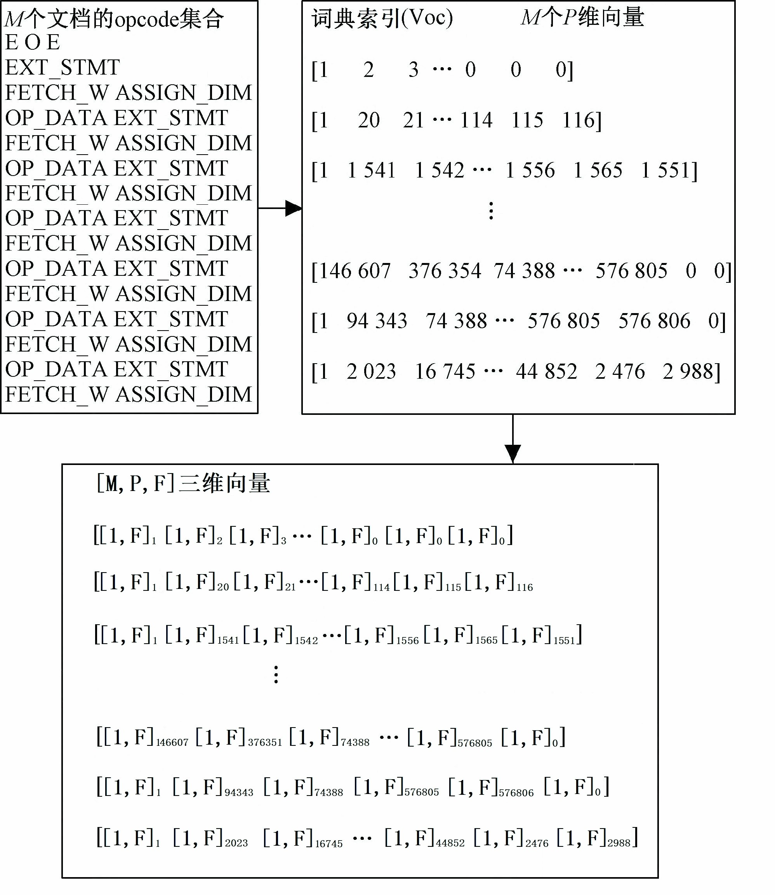

Word2vec是一种将文本转化为词向量的算法，即将词条映射为一个定长的连续的稠密向量，由这些向量构成一个向量空间，该向量的维数可以在事前确定，一般可以为50维或100维。

例如：

```
Apple = [1.2,0.2,0.3,0.5]
Pear = [0.1,0.3,0.5,1.5]
Banana = [2.2,0.2,0.4,0.6]
Orange = [0.6,0.1,1.0,0.2]
```

每个词被表示成一个[1,4]的向量矩阵。

在文本处理的任务中直接处理的是文当，而一个文本中包含很多词，所以需要将文本想办法用Word2vec向量表示 。这里有两种思路：

> 1. 直接将各个词的词向量串接起来，将整个文档表示成一个三维的向量
> 2. 将文本中各个词的词向量相加求平均，由最终的平均向量代表整个文本

## 三维文档向量

处理如图所示：



最终将文档表示成一个[M, P, F]三维向量，其中M代表文档个数，P代表每个文档的长度，为了便于神 经网络处理会将P处理成统一 长度，F代表最大特征值，即Word2vec训练出的向量大小。

这种表示方法CNN处理效果较好。

代码实例如下：

```python
#为了统一文本长度，设置最大文本长度，超过的截断，不足的用0.向量补齐
max_document_length = 500
#最大特征长度，即训练的词向量维度
max_feature = 200

def getVecsByWord2Vec(model, corpus, size):
    global max_document_length

    all_vectors = []
    embeddingDim = model.vector_size
    #0.向量，用于填充
    embeddingUnknown = [0. for i in range(embeddingDim)]
    
    #逐句获取词向量并拼接
    for text in corpus:
        this_vector = []
        #切除掉最大文档长度后的词
        text = text[:max_document_length]
        #逐词获取词向量并拼接
        for i,word in enumerate(text):
            if word in model.wv.vocab:        
                this_vector.append(model[word])
            else:
                this_vector.append(embeddingUnknown)
        
        #不足长度的填充至最大文档长度     
        dim = np.shape(this_vector)
        if dim[0] < max_document_length:    
            pad_length = max_document_length-i-1
            for n in range(0,pad_length):
                this_vector.append(embeddingUnknown)    
        all_vectors.append(this_vector)

    x = np.array(all_vectors)

    return x

def get_feature_by_opcode_word2vec():
    global max_document_length

    x = []
    y = []
    
	# 若有三维文档向量直接加载
    if os.path.exists(wv_data_pkl_file) and os.path.exists(label_pkl_file):
        f = open(wv_data_pkl_file, 'rb')
        x = pickle.load(f)
        f.close()
        f = open(label_pkl_file, 'rb')
        y = pickle.load(f)
        f.close()
    else:
        # 导入训练数据，自定
        x, y = load_data_pkl_file()

        cores=multiprocessing.cpu_count()
        #若有训练好的词向量模型则直接加载
        if os.path.exists(word2vec_bin):
            print "Find cache file %s" % word2vec_bin
            model=gensim.models.Word2Vec.load(word2vec_bin)
        #若没有则训练再保存词向量模型
        else:
            model=gensim.models.Word2Vec(size=max_features, window=5, min_count=5, iter=10, workers=cores)
            model.build_vocab(x)
            model.train(x, total_examples=model.corpus_count, epochs=model.iter)
            model.save(word2vec_bin)
		
        #循环拼接出三维文档集合向量
        x = getVecsByWord2Vec(model, x, max_features)

        f = open(wv_data_pkl_file, 'wb')
        pickle.dump(x, f)
        f.close()

    return x,y
```

## 平均词向量

直接将每个文档中所有词的词向量相加求平均 ，用一个[1,F]的二维平均向量代表改文档。再将所有文档逐个拼接得到一个[M,F]的向量来表示整个文档集合。这种表示方法计算量较小 ，MLP处理效果还好，CNN效果极差。

代码实例如下：

```python
#最大特征长度，即训练的词向量维度
max_feature = 200

def buildWordVector(model,text, size):
    vec = np.zeros(size).reshape((1, size))
    count = 0.
    #逐词获取词向量并累加
    for word in text:
        try:
            vec += model[word].reshape((1, size))
            count += 1.
        except KeyError:
            continue
    #求平均向量
    if count != 0:
        vec /= count
    return vec

def get_feature_by_opcode_word2vec():
    global max_document_length

    x = []
    y = []
    
	# 若有三维文档向量直接加载
    if os.path.exists(wv_data_pkl_file) and os.path.exists(label_pkl_file):
        f = open(wv_data_pkl_file, 'rb')
        x = pickle.load(f)
        f.close()
        f = open(label_pkl_file, 'rb')
        y = pickle.load(f)
        f.close()
    else:
        # 导入训练数据，自定
        x, y = load_data_pkl_file()

        cores=multiprocessing.cpu_count()
        #若有训练好的词向量模型则直接加载
        if os.path.exists(word2vec_bin):
            print "Find cache file %s" % word2vec_bin
            model=gensim.models.Word2Vec.load(word2vec_bin)
        #若没有则训练再保存词向量模型
        else:
            model=gensim.models.Word2Vec(size=max_features, window=5, min_count=5, iter=10, workers=cores)
            model.build_vocab(x)
            model.train(x, total_examples=model.corpus_count, epochs=model.iter)
            model.save(word2vec_bin)
		
        #循环拼接出二维文档集合向量
        x= np.concatenate([buildWordVector(model,z, max_features) for z in x])
        #归一化
		x = scale(x)
        
        f = open(wv_data_pkl_file, 'wb')
        pickle.dump(x, f)
        f.close()

    return x,y
```

