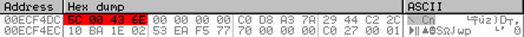

## 445端口

首先介绍一下这个引发了诸多特大漏洞的445端口。

TCP 445端口主要运行两种服务：

- SMB 网络服务
- MSRPC 网络服务

**SMB（Server Message Block，服务器消息块）**首先提供了 Windows 网络中最常用的远程文件与打印机共享网络服务，其次，SMB的命名管道是 MSRPC 协议认证和调用本地服务的承载传输层。

SMB 作为应用层协议，其直接运行在TCP 445端口上，也可通过调用 NBT 的 TCP 139端口来接收数据。

**MSRPC（Microsoft Remote Procedure Call，微软远程过程调用）**是对 DCE/RPC 在 Windows 系统下的重新改进和实现，用以支持Windows系统中的应用程序能够无缝地通过网络调用远程主机上服务进程中的过程。

DCE/RPC 独立运行于网络传输层协议上，采用的网络传输层协议包括：

- ncacn_ip_tcp => TCP 139
- ncadg_ip_udp => UDP 135
- ncacn_np => TCP 139、445

其中，主要使用的是 ncacn_np（SMB命名管道传输协议），也就是利用 SMB 命名管道机制作为 RPC 的承载传输协议（MSRPC over SMB）。

只有少数如MS09-050是直接针对SMB服务的，而MSRPC作为调用大量本地服务进程的网络接口，常常被利用 MSRPC over SMB 为通道如MS08-067来攻击本地服务中存在的安全漏洞。

# 0x01 MS08-067漏洞原理

MS08-067漏洞是通过 MSRPC over SMB 通道调用 Server 服务程序中的 NetPathCanonicalize 函数时触发的，而 NetPathCanonicalize 函数在远程访问其他主机时，会调用 NetpwPathCanonicalize 函数，对远程访问的路径进行规范化，而在 NetpwPathCanonicalize 函数中存在的逻辑错误，造成栈缓冲区可被溢出，而获得远程代码执行（Remote Code Execution）。

所谓路径规范化，就是将路径字符串中的【/】转换为【\】，同时去除相对路径【\.\】和【\..\】。如：

```text
**/*/./**   =>  **\*\**
**\*\..\**  =>  **\**
```

在路径规范化的操作中，服务程序对路径字符串的地址空间检查存在逻辑漏洞。攻击者通过精心设计输入路径，可以在函数去除【\..\】字符串时，把路径字符串中内容复制到路径串之前的地址空间中（低地址），达到覆盖函数返回地址，执行任意代码的目的。

## 路径处理流程

NetpwPathCanonicalize 函数并没有直接进行输入路径和规范化，而是继续调用了下级函数CanonicalizePathName 来进行路径整理，将待整理的路径字符串进行规范化，然后再**保存到预先分配的输出路径缓冲区buffer中**。

路径处理流程：

1. 检查待整理路径的第一个字符
2. 调用msvcrt.dll模块的wcslen函数计算路径长度
3. 调用msvcrt.dll模块的wcscat函数把待整理路径全部复制到新申请的内存中

\4. 调用wcscpy函数，去掉待整理路径中第一个表示父目录的相对路径复制到strTemp，如：

```text
\******\..\..\***   =>  \..\***
```

5.循环调用wcscpy，直到路径整理完毕

在这里我们知道了，在规范化复制时要寻找表示父目录的【\..\】字符串及其前面的一个【\】字符串，将这一段去掉并将新路径复制。


如图，第一次检查时去掉了第一个相对路径并复制到缓冲区

**但是，当【\..\】字符串在路径字符串的最前面时，那么其前面的一个【\】就在缓冲区外面了，就是在这里产生了向前（低地址）的溢出。**


## 缓冲区溢出

需要明确的是，微软对路径规范化时的字符串复制可能出现的缓冲区溢出做了初步的防御。

在每次向缓冲区中复制字符串时，无论是用 wcsccpy 还是 wcscat，在复制前总要比较源字符串的长度，保证长度小于某个值（207），否则不会继续复制，这一策略确保缓冲区不会向高地址溢出，即当前函数返回时不会发生问题。

**但是注意，**在规范化表示路径，寻找父目录的【\..\】字符串前面的【\】字符时，程序做了判断和边界检查：如果当前比较字符的地址与源字符串地址相同，就表明整个字符串已经查找完毕，程序就会停止查找。

然而它唯独漏了一种情况，就是当父目录相对路径【\..\】字符串在源字符串的开头时，在开始查找时比较的字符串(【\】到【\..\】)位于缓冲区之外，这导致了复制的字符串向低地址的溢出，造成函数wcscpy的返回地址被覆盖。


# 0x02 漏洞还原分析 

**实验环境**

- 靶机 Windows2003 SP0 EN
- 漏洞组件 netapi32.dll
- 工具 IDA Pro、OllyDbg

选择 Windows XP SP3 EN 系统主机作为分析环境，定位到包含该安全漏洞的系统模块netapi32.dll（路径C:\Windows\system32）和调用漏洞服务 Server 的进程 svchost.exe，目标进程命令行为

```text
C:\Windows\System32\svchost.exe-k netsvcs
```

用 IDA pro 打开 netapi32.dll，找到漏洞所在的 NetpwPathCanonicalize 函（每次运行堆栈中的地址会不同，但各函数的地址一样），如图在书中提到

> 查看该函数流程图，可以看到，此函数并没有直接进行输入路径的规范化， 而是继续调用了下级函数 CanonicalizePathName

然而在实际操作中并没有发现 CanonicalizePathName 这个函数，并且多种资料表明应当是调用 CanonPathName 函数进行规范化。

IDA分析 NetpwPathCanonicalize 函数代码（F5 + 整理 + 主要代码）：

该函数声明如下：

```c
DWORD NetpwPathCanonicalize(
    LPWSTR PathName, //需要标准化的路径
    LPWSTR Outbuf, //存储标准化后的路径的Buffer
    DWORD OutbufLen, //Buffer长度
    LPWSTR Prefix, //可选参数，当PathName是相对路径时有用
    LPDWORD PathType, //存储路径类型
    DWORD Flags // 保留，为0
 )
```

## 动态调试

通过wmic查看命令行参数为svchost.exe -k netsvcs的进程pid


打开OllyDbg，点击file->attach，附着到svchost.exe进程上


View->Executable modules双击netapi32，在cpu指令窗口右键选Search for查找exec(label) in current module，找到函数NetpwPathCanonicalize，地址为71C44A3E，在此处设下断点。


## 追踪漏洞触发过程

回到CPU指令窗口运行程序，然后攻击机Metasploit加载ms08_067_netapi模块并exploit


### NetpwPathCanonicalize中断

分析环境中的svchost程序会中断在 NetpwPathCanonicalize 函数的入口地址处。该函数的传入参数如下所示：


```
esp    		[esp]		* 注释 *
00ECF924	02248D34	;指向待整理路径
00ECF928	022321D8	;指向输出路径buffer
00ECF92C	000003F1	;输出buffer的长度
00ECF930	02248FB0	;指向prefix，值为 \x5C\x00 ，即unicode ‘\’
00ECF934	02248FB4	;指向路径类型，值为 0x1001
00ECF938	00000000	;WORD Flags保留，值为0
```

### CanonicalizePathName中断

结合IDA pro对 NetpwPathCanonicalize 的流程分析，在 地址处将调用下一级函数 CanonPathName，在此地址设下断点。


运行到此断点，然后跟踪函数 CanonPathName，传入参数如下所示：

```text
00F0F8FC	00157570	;指向prefix，值为\x5C\00，即Unicode"\"
00F0F900	001572F4	;指向待整理路径
00F0F904	02132E80	;指向输出路径的buffer
00F0F908	000003F9	;输出buffer的长度
00F0F90C	00000000	;WORD Flag保留字，值为0
```

从上两个函数的参数传递可以看出，函数 CanonPathName 进行路径整理，然后再保存到预先分配的输出路径缓冲区buffer中。

### 待整理路径结构

在OD中查看待整理路径的结构，路径是Unicode字符串，以【\x5C\x00】(Unicode字符“\”)开始，【\x00\x00】结束，中间包含一些随机的大小写字母，较长一段不可显示的字符是经过编码的Shellcode，其中最关键的是两个连在一起的父目录相对路径【\..\..\】。


整个待整理路径形如：

```text
\******\..\..\***
```

### 整理路径前的预操作

在待整理路径所在内存地址000C0F50处4字节上设内存访问断点


按F9运行，会中断3次，前两次分别是检查待整理路径的第一个字符和调用wcslen函数，第三次是在调用wcscat函数。分析第三次传入栈中两个参数


第一个是strDestination，指向一段以【\x5c\x00】开头的内存空间；第二个是strSource，指向上述待整理路径前两字节【\x5c\x00】后的内容。

程序把待整理路径全部复制到strDestination，即0x001572F6处。在此4字节设断点，类型选择"Hardware, on access"DWord。


### 复制路径到缓冲区

F9继续运行，第4次中断在0x77BD4010 ，内存里显示这里将src的前两个字符复制到了dest的【\x5C\x00】后面，这是由于这两个字节设了断点的原因。



第5次中断在0x71C44B1C，位于wcscat函数内，内存显示已将src复制到dest，如图:


### 第一次路径规范化

按F9运行，中断多次后停在内存0x77bd4d36处，通过栈可知此处属于wcscpy函数。此处调用该函数进行第一次路径规范化。如图


当前参数src值为0x00EC6E0，指向【\..\*\*\*】;参数 strDestination 值为0x00ECF4DC，指向temp中的第一个字符【\】。 显然，这次路径规范化即把待整理路径中第一个字符【\】和第一个【\..\】相对路径之间的内容抛弃。


而此时wcscpy源地址src在edx寄存器中，指向【\..\***】；目的地址dest在ecx寄存器中，指向待整理路径第一个字符【\】，如图


所以，这次字符串复制操作就是去掉第一个表示父目录的相对路径，即待整理路径temp中的第一个【\】和第一个【\..\】之间的内容成为无用路径被抛弃。操作完成后，temp中的路径字符形如【\..\***】。

第一次规范化后，待整理路径形如

```text
\..\***
```

由于还有【\..\】，还需要进行一次规范化，而这第二次规范化正是玄机所在。

### 第二次路径规范化

由于每次路径规范化都会调用wcscpy函数，接下来删除0x00ECF4DC的硬件断点，直接在wcscpy函数的入口地址0x77BD4D28处下断点。


F9运行后中断在wcscpy函数入口0x77BD4D28处，调用wcscpy函数传入的参数


```
esp			[esp]		* 注释 *
00ECF4AC	00ECF494	目的地址，指向的内存区域值为\x5c\x00，即【\】
00ECF4B0	00ECF4E2	源地址，指向第二个相对路径【\..\】的最后一个斜杠
```

正常情况下，这次规范化处理会和第一次执行同样的操作，去除第二个相对路径【\..\】，从而完成第二次的路径规范化。但这里出现了一个意外的情况，temp的首地址是0x00ECF4DC，而此次字符串复制操作的目的地址dest却在0x00ECF494，在temp之前，如图


同时注意到，栈指针ESP值为0x00ECF4A8，该地址指向wcscpy函数的返回地址0x71C52FD4。ESP到复制目的dest地址0x00ECF494只有0x14字节，于是，函数wcscpy如果继续执行，将用源字符串src覆盖wcscpy函数的返回地址。

执行到retn命令，可以看到返回地址变成了0x0100129E，，该地址的指令为：

```
00100129E		FFD6		call esi
```

执行 call esi（ES=0x00F0F4DE）指令，正好将EIP指向复制尽量的字符串中构造好的第8字节空指令，接着是【\xeb\x62】（jmp 0x62），此jmp指令跳过中间的随机字符串，指向经过编码的Shellcode，如图


所以这里是由于内存0x00F0F494处的一个【\】(0x5C)，使得出现在处理父母了相对路径【\..\】时往前溢出了待处理路径，从而将字符串覆盖到函数wcscpy返回地址的位置，跳转到shellcode造成远程代码执行。

正如前面所提到的，当【\..\】在源字符串开头的时候，在开始查找时，比较的字符位于缓冲区之外导致了向前的溢出。